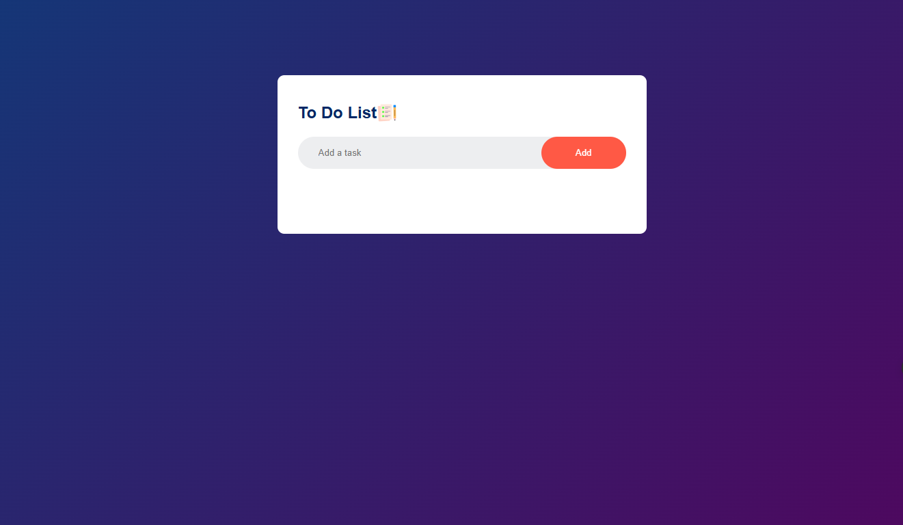

## 📋 Day 3 - To Do List App

🔗 **Live Demo:** [https://todolistapp121.netlify.app/](https://todolistapp121.netlify.app/)

This is a responsive and interactive **To Do List** web app built using **HTML, CSS, and JavaScript**. It allows users to add, check off, and remove tasks, with data saved in the browser using `localStorage`.

---

### 📸 Preview

 <!-- You can replace with a real screenshot of the full app UI -->

---

### 🔧 Features

* ✅ Add new tasks  
* 📝 Mark tasks as completed  
* ❌ Delete tasks  
* 💾 Save tasks in local storage  
* 🎨 Clean and modern UI with custom icons

---

### 📁 Folder Structure

```

Day3-To\_Do\_List\_App/
├── images/
│   ├── checked.png
│   ├── unchecked.png
│   └── icon.png
├── index.html
├── script.js
└── style.css

````

---

### 🚀 How to Run

1. **Clone the repository:**

   ```bash
   git clone https://github.com/Sasmit12/Coding.git

2. **Navigate to the folder:**

   ```bash
   cd Day3-To_Do_List_App
   ```

3. **Open `index.html` in your browser.**

---

### 📌 Technologies Used

* HTML5
* CSS3
* JavaScript (Vanilla)
* `localStorage` for data persistence

---

### 📷 Screenshots

You can add real screenshots here for better presentation:

```

```

---

### 🧑‍💻 Author

**Sasmit** – [GitHub](https://github.com/Sasmit12)

---
